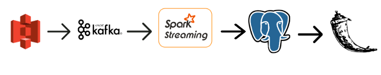

# Bikeshare Availability

The goal of this project is for bikeshare customer to have near real time information on the availability status of bikeshare docks.

This ETL uses Kafka, Spark Streaming and Postgres. The data consists of records of when bikes leave and enter docks which are in csv files stored in an S3 bucket.

The dataset is all available [citibike historical bike data](https://www.citibikenyc.com/system-data)

## Table of Contents
1. [Pipeline](README.md#Pipeline)
2. [Evironment SetUp](README.md#Evironment-Setup)
3. [Demo](README.md#Demo)
4. [Further Extention](README.md#Further-Extention)

    
## Pipeline

### Kafka
producer: 
The producer fetches the unzipped Citibike csv files from an S3 bucket. It uses a schema to extract the desired information (time, location, etc)  from each row of the file. Although the data from Citibike is actually a batch, the producer simulates near real time information of the bikes by splitting the information in each row into the information related to the start of the bikes journey (start time, start location, etc.) and the information related to the end of the bikes journey (end time, end location, etc.)

### Spark Streaming
Spark Streaming consumes messages as a dstream from the Kafka broker at a microbatch interval of 5 seconds and distributes this dstream among the workers. Each rdd from the dstream is written to a dataframe according to one of three schemas, each corresponding to a different table in the postgres database, and writes each frame to the database.

### Postgres
This project includes a normalized database that contains three tables: `Records`, `Location`, and `Frequency`. 

The columns in the `Records` table are: 
      -     time (Datetime)
      -     bike id (Integer)    
      -     location in latitude and longitude ([Integer, Integer])
      
The columns in the `Location` table are:
      -     street (text)
      -     location in latitude and longitude ([Integer, Integer])
      
The columns in the `Frequency` table are:
      -     time (Datetime)
      -     amount during that time (Integer)
 

### Flask
The main Flask application (`app.py`) queries the database through the API (`database.py`), to find the current status of the bike docks and displays the docks on the map if there are bikes available. The app also listens for user search, if valid, and queries to find neighboring available bike docks. 

## Environment Setup
Python version 3.5
### AWS Setup
8 AWS EC2 instances (nodes):

- (3 nodes) Kafka Cluster
  - 3 partitions and 2 replication factors
         
- (3 nodes) Spark Streaming Cluster

   - 1 master and 2 workers
         
- Postgres Node
   - Change listening address in `postgresql.conf` from local host to the IP addresses of the spark streaming nodes and changed the host postgresql is allowed to connect to in `pg_hba.conf` 

- Flask Node
    - runs the application, public facing open to the internet, different SG/rules than other clusters

## Demo
[Demo](https://www.youtube.com/watch?v=QS-lSPjHsqQ)

When the customer opens the app they will see blue circles on the New York City map that represent the open bikeshare docks at that time. They also have the option of searching a location, which will display as a red circle on the map, and the available bikeshare docks in a 3 block radius of that location will appear on the map as blue dots. A flash message will appear on the screen if the customer inputs a location that is not in the format of building number street name such as 1 Park Avenue.

## Further Extention
Further extensions for this project can be:
- replacing Spark Streaming with Structured Streaming
- preprocessing the data in spark and storing it in s3 before sending it through the [pipeline above](README.md#Pipeline)
- chaos testing 
- historical view of data in the flask app

